## Project 5: Realtime

The project handout can be found [here](https://cs1230.graphics/projects/realtime/1).

### Output Comparison

Run the program, open the specified `.json` file and follow the instructions to set the parameters.

If the output you are generating is an image, save the image with the specified file name using the "Save Image" button in the UI. Be sure to follow the instructions in the left column to set the file name. Once you save the images, they will appear in the table below.

If the output you are generating is a video, reference the [Screen Recording Guide](https://cs1230.graphics/docs/screen-recording) to capture a video of the specified interaction. Once you've recorded everything, navigate to this template file in Github, click edit, and either select or drag-and-drop each of your videos into the correct location. This will upload them to GitHub (but not include them in the repo) and automatically embed them into this Markdown file by providing a link. Make sure to double-check that they all show up properly in the preview.

We're **not** looking for your video to **exactly** match the expected output (i.e. draw the exact same shape). Just make sure to follow the instructions and verify that the recording fully demonstrates the functionality of that part of your project.

> [!NOTE]
> There may be issues with the image saving functionality, and the images may not save the exact same way as the expected outputs. This is acceptable, as long as your output demonstrates correct functionality.

|                                           File/Method To Produce Output                                            |                                                     Expected Output                                                     |                                                                     Your Output                                                                     |
| :----------------------------------------------------------------------------------------------------------------: | :---------------------------------------------------------------------------------------------------------------------: | :-------------------------------------------------------------------------------------------------------------------------------------------------: |
|                Input: `unit_cone.json` Output: `unit_cone.png` Parameters: (5, 5, 0.1, 100)                |            |            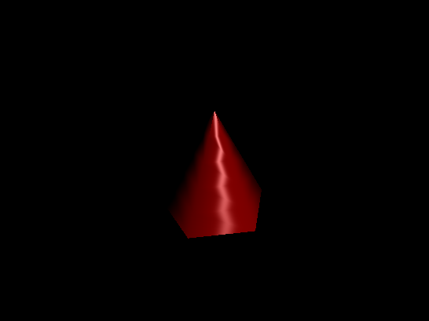            |
|            Input: `unit_cone_cap.json` Output: `unit_cone_cap.png` Parameters: (5, 5, 0.1, 100)            |        |        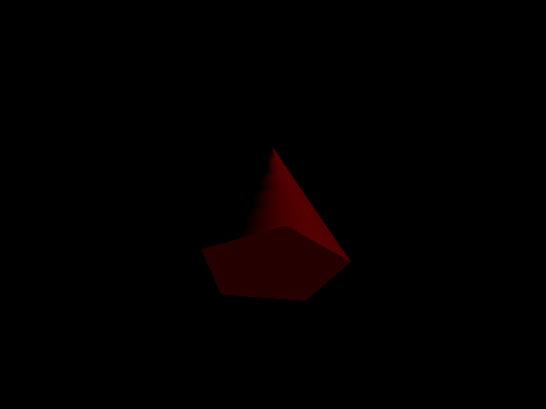        |
|               Input: `unit_cube.json` Output: `unit_cube.png`  Parameters: (5, 5, 0.1, 100)                |            |            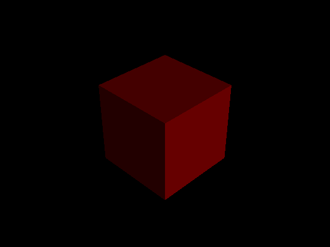            |
|            Input: `unit_cylinder.json` Output: `unit_cylinder.png` Parameters: (5, 5, 0.1, 100)            |        |        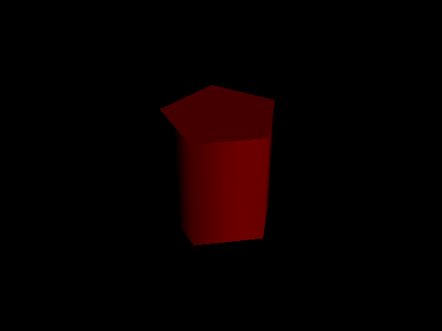        |
|              Input: `unit_sphere.json` Output: `unit_sphere.png` Parameters: (5, 5, 0.1, 100)              |          |          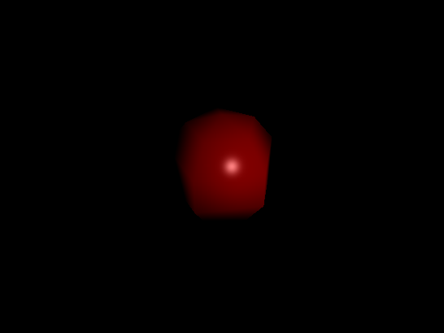          |
|          Input: `unit_cone.json` Output: `unit_cone_min.png` Parameters: (**1**, **3**, 0.1, 100)          |            |        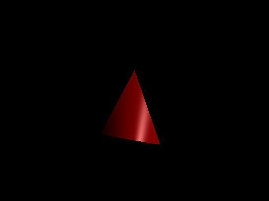        |
|      Input: `unit_cone_cap.json` Output: `unit_cone_cap_min.png` Parameters: (**1**, **3**, 0.1, 100)      |        |        |
|          Input: `unit_cube.json` Output: `unit_cube_min.png` Parameters: (**1**, **1**, 0.1, 100)          |            |                |
|      Input: `unit_cylinder.json` Output: `unit_cylinder_min.png` Parameters: (**1**, **3**, 0.1, 100)      |        |    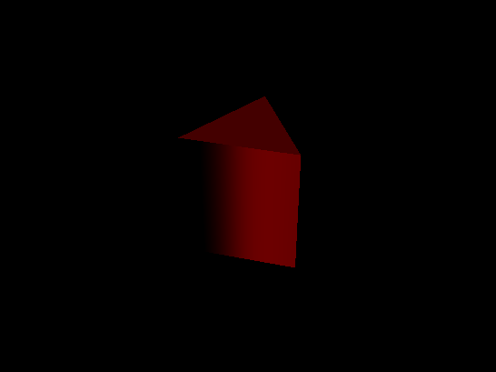    |
|        Input: `unit_sphere.json` Output: `unit_sphere_min.png` Parameters: (**2**, **3**, 0.1, 100)        |          |      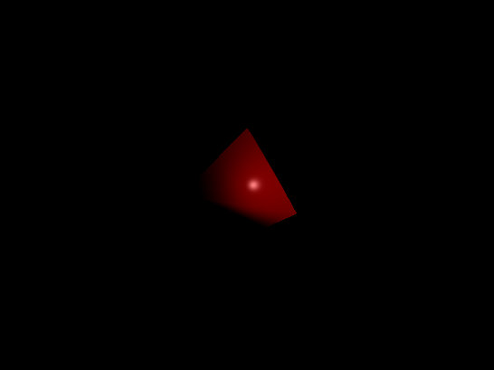      |
|           Input: `parse_matrix.json` Output: `parse_matrix.png` Parameters: (**3**, 5, 0.1, 100)           |         |         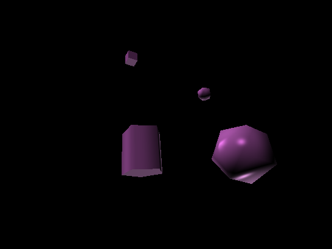         |
|            Input: `ambient_total.json` Output: `ambient_total.png` Parameters: (5, 5, 0.1, 100)            |        |        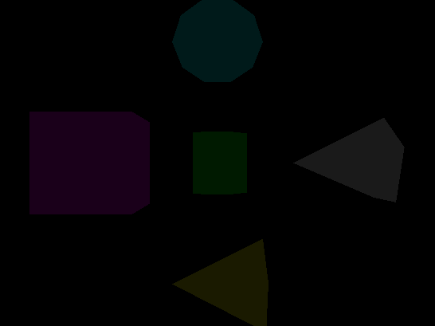        |
|            Input: `diffuse_total.json` Output: `diffuse_total.png` Parameters: (5, 5, 0.1, 100)            |        |                |
|           Input: `specular_total.json` Output: `specular_total.png` Parameters: (5, 5, 0.1, 100)           |       |              |
|              Input: `phong_total.json` Output: `phong_total.png` Parameters: (5, 5, 0.1, 100)              |          |          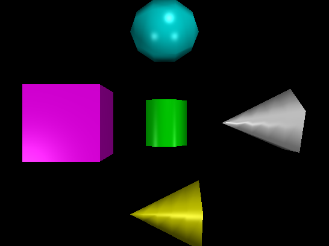          |
|      Input: `directional_light_1.json` Output: `directional_light_1.png` Parameters: (5, 5, 0.1, 100)      |  |  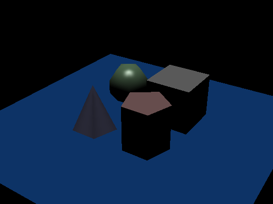  |
| Input: `directional_light_2.json` Output: `directional_light_2.png` Parameters: (**10**, **10**, 0.1, 100) |  |  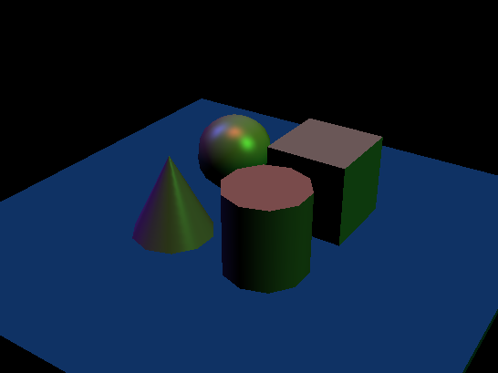  |
|      Input: `phong_total.json` Output: `phong_total_near_far.png` Parameters: (5, 5, **9.5**, **12**)      |  | 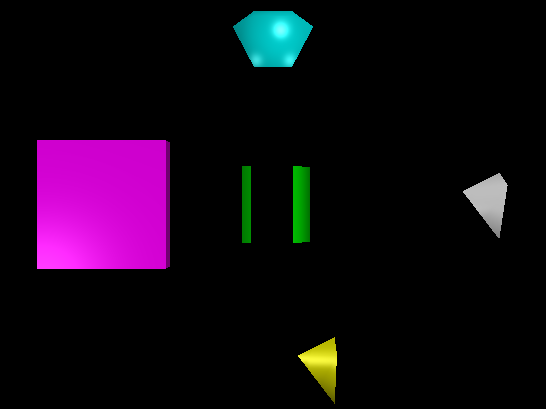 |
|      Input: `directional_light_1.json` Output: `directional_light_1_near_far.png` Parameters: (**25**, **25**, **8**, **10**)      |  | 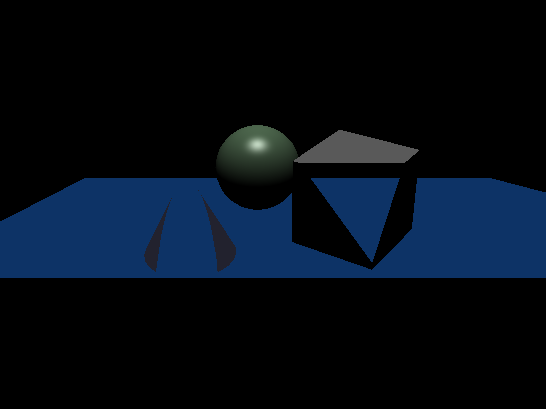 |
| Input: `point_light_1.json` Output: `point_light_1.png` Parameters: (5, 5, 0.1, 100) |  |  |
| Input: `point_light_2.json` Output: `point_light_2.png` Parameters: (5, 5, 0.1, 100) |  | 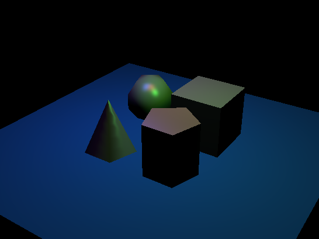 |
| Input: `spot_light_1.json` Output: `spot_light_1.png`  Parameters: (5, 5, 0.1, 100)  |   |  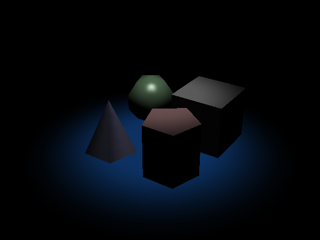  |
|  Input: `spot_light_2.json` Output: `spot_light_2.png` Parameters: (5, 5, 0.1, 100)  |   |  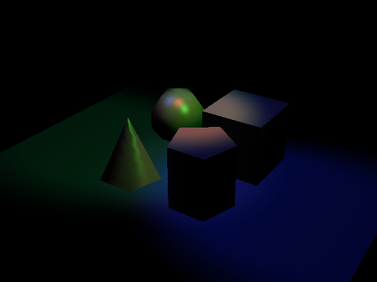  |

#### Camera Translation

_Instructions:_ Load `chess.json`. For about 1 second each in this order, press:

- <kbd>W</kbd>, <kbd>A</kbd>, <kbd>S</kbd>, <kbd>D</kbd> to move in each direction by itself
- <kbd>W+A</kbd> to move diagonally forward and to the left
- <kbd>S+D</kbd> to move diagonally backward and to the right
- <kbd>Space</kbd> to move up
- <kbd>Cmd/Ctrl</kbd> to move down

##### Expected Output

https://github.com/BrownCSCI1230/projects_realtime_template/assets/45575415/710ff8b4-6db4-445b-811d-f6c838741e67

##### Your Output

https://github.com/BrownCSCI1230/proj5-zinczhao/blob/main/student_outputs/realtime/required/camera_translation.mov

#### Camera Rotation

_Instructions:_ Load `chess.json`. Take a look around!

##### Expected Output

https://github.com/BrownCSCI1230/projects_realtime_template/assets/45575415/a14f4d32-88ee-4f5f-9843-74dd5c89b9dd

##### Your Output

https://github.com/BrownCSCI1230/proj5-zinczhao/blob/main/student_outputs/realtime/required/camera_rotation.mov

### Design Choices

It is generally very bad practice to put everything in one file (which I did in `realtime.cpp`). However, this is the easiest way to prompt ChatGPT to do and debug this project, and it is crazy good at this project. That said, even with putting everything into `realtime.cpp`, the longest function is like 50 line-ish, which is not that bad. I put all the shapes in the `shapes` folder under `src` like what we have in lab 8, and used `resources/shaders/default.vert` and `default.frag` as files to store my shaders, and that's about it.

### Collaboration/References

Like I mentioned in design choices, ChatGPT is crazy good at this project. To the best of my understanding of the LLM policy, my use of ChatGPT in this project is not a violation of the collaboration policy of this course. 

As stated in the collaboration policy,

> In particular, you may find them useful for writing so-called "boilerplate" code, e.g. the many lines of code required to set up an empty OpenGL program that does nothing.

This is true. However, once we have the "boilerplate" code, we could further have it implement each part for us. This approach was not very helpful in previous projects, but was in this project.

Also as the policy states:

> **Do not use generated code that you do not understand**. It may well be incorrect, and if you don't understand it, how will you debug it? Note that TAs will **not** spend time in hours helping you understand or debug code that you did not write yourself. Also, during your mentor meetings, your TA will ask you to explain how your code works; if you can't do that, you'll be in violation of this collaboration policy.

In my use case, I have not asked any TA to debug my code. The intuition here is we could have generative AI to generate the code for us. And if the code is hard to debug, hard to understand, or just too far from being correct, then we could always fall back to doing the part ourselves. It does not hurt to ask AI first. Plus, at times, the AI itself is well-capable of debugging its own code.

And yes, as I am aware of the fact that I will be asked how my code works, I read the code until I fully understand how and why it works. This is not only to "perform" well in TA mentor meetings but also to gain an edge in future debugging, which proved to be very essential in the raytracing project (but not this one though). And, of course, asking AI how the code works helps as well.

I hope I will not be punished for my honesty here.

### Known Bugs

To the best of my knowledge, there is no known bugs in my implementation.

### Extra Credit

No extra credit implemented.
