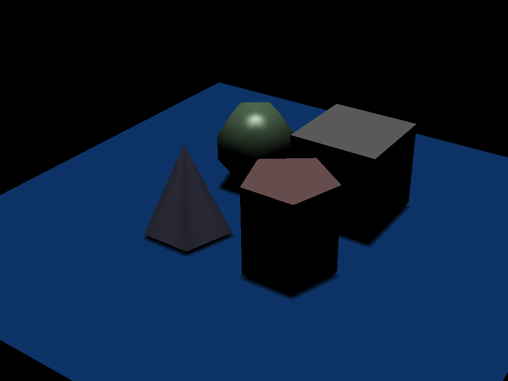
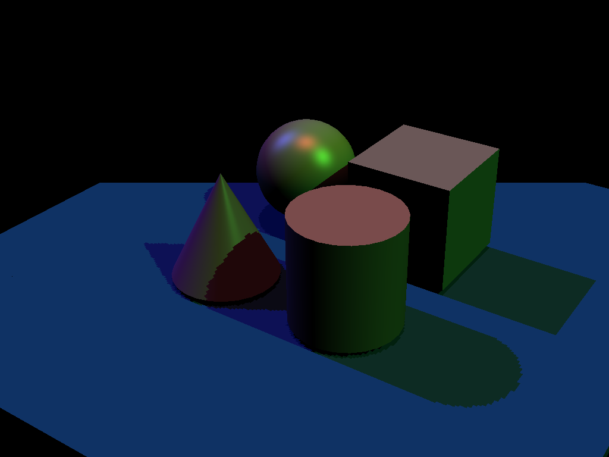
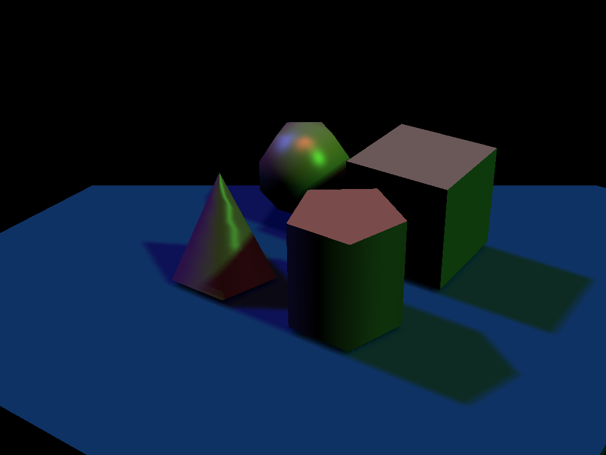
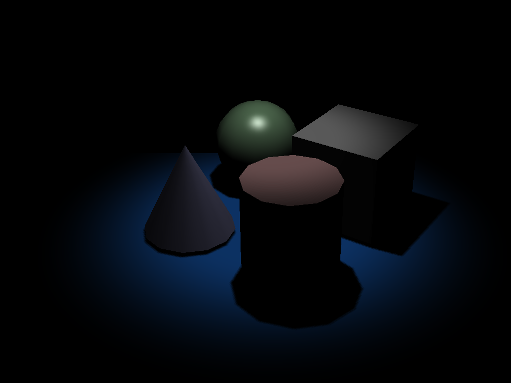
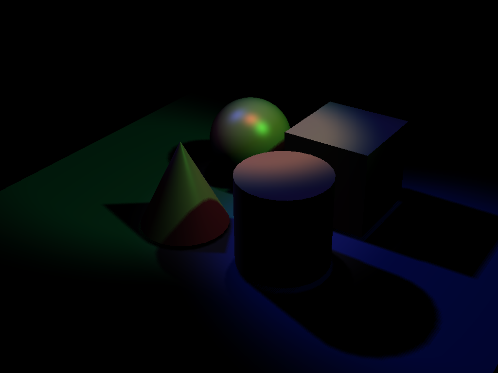
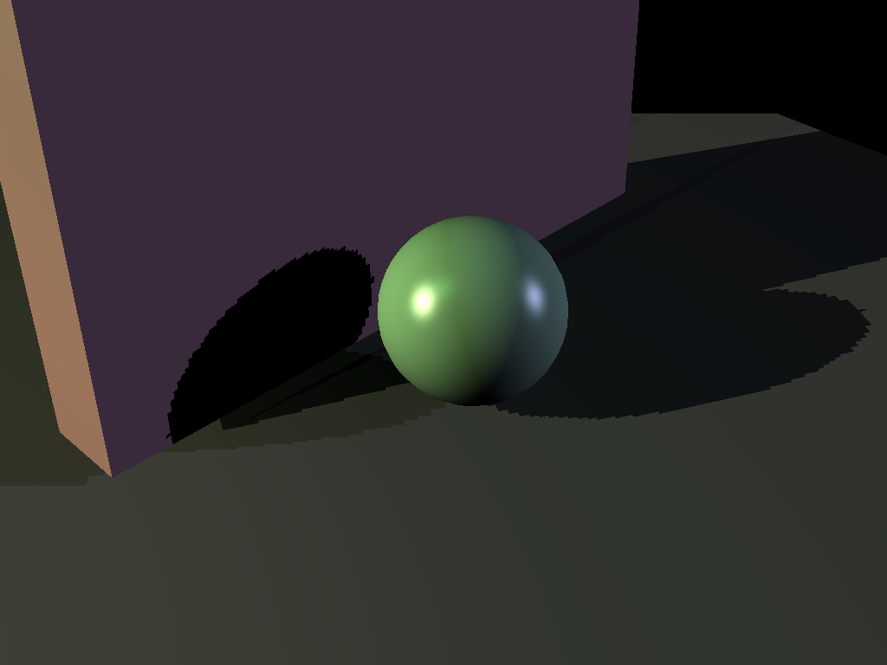
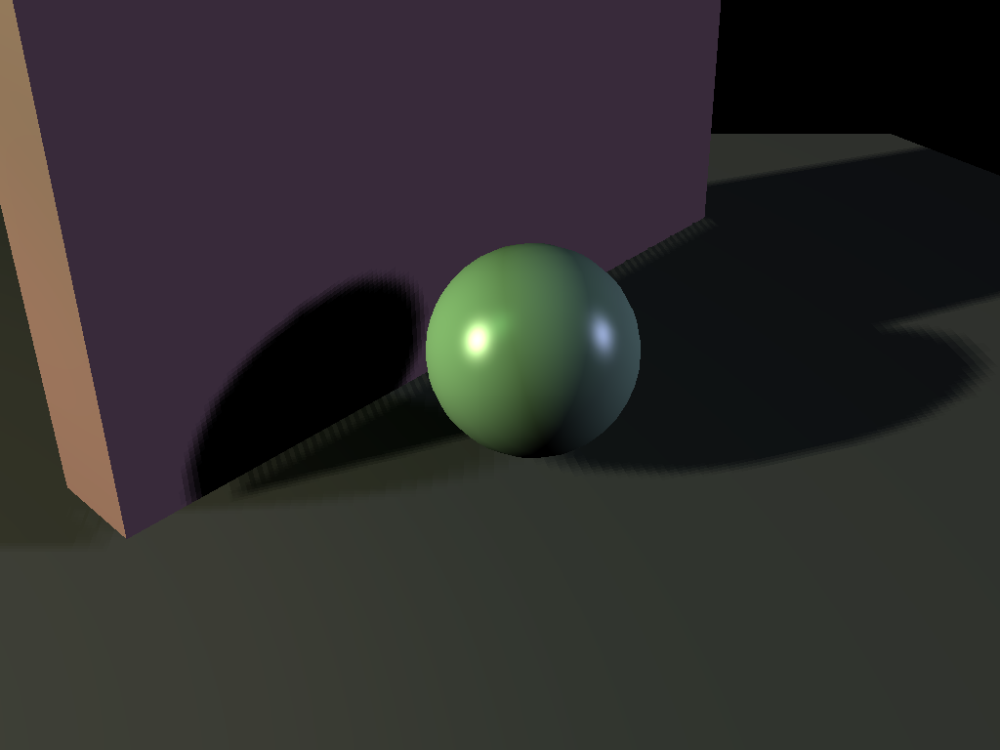

## Project 6: Final Project Gear Up

The project handout can be found [here](https://cs1230.graphics/projects/final/gear-up).

### Test Cases

| File/Method To Produce Output                                                                                             | Expected Output                                          |
| :------------------------------------------------------------------------------------------------------------------------ | :------------------------------------------------------: |
| Input: `directional_light_1.json` Output: `directional_light_1.png` Parameters: (5, 5, 0.1, 100)                  |             |
| Input: `directional_light_1.json` Output: `directional_light_1_soft.png` Parameters: (5, 5, 0.1, 100)            |        |
| Input: `directional_light_2.json` Output: `directional_light_2.png` Parameters: (25, 25, 0.1, 10)                |             |
| Input: `directional_light_2.json` Output: `directional_light_2_soft.png` Parameters: (5, 5, 0.01, 10)            |        |
| Input: `spot_light_1.json` Output: `spot_light_1.png` Parameters: (25, 25, 2.0, 100)                             |                    |
| Input: `spot_light_1.json` Output: `spot_light_1_soft.png` Parameters: (12, 12, 3.0, 10)                         |               |
| Input: `spot_light_2.json` Output: `spot_light_2.png` Parameters: (10, 10, 3.0, 100)                             |                    |
| Input: `spot_light_2.json` Output: `spot_light_2_soft.png` Parameters: (25, 25, 3.0, 100)                        |               |
| Input: `shadow_test.json` Output: `shadow_test.png` Parameters: (25, 25, 0.01, 10)                               |                     |
| Input: `shadow_test.json` Output: `shadow_test_soft.png` Parameters: (25, 25, 0.01, 10)                          |                |

### Design Choices
Shadow mapping (for direction and spot lights):
- One 2D depth texture is used per light in the scene
- Each depth texture is attached as a `GL_DEPTH_ATTACHMENT` to a single depth-only FBO `m_fbo_shadow`
- For each light, we also compute its light space MVP matrix. Directional lights use an an orthographic projection matrix, and spot lights use a perspective projection matrix.
- Rendering to each depth map: 
    - Vertex shader: Converts the object space positions to light space using the object model matrix and the light MVP matrix
    - Fragment shader: Empty since depth is automatically written
- Rendering shadows: 
    - Integrated into Phong illumination shader pipeline.
    - Vertex shader: Also converts the object space positions to light space using the object model matrix and the light MVP matrix
    - Fragment shader:
        - For each light, we have our light space position from the vertex shader. For spot lights, we divide the light space position by shadowCoord.w (perspective divide). Then, multiply the coordinates by a bias matrix to transform them from from clip space `[-1,1]` to texture space `[0,1]`
        - To see if a position is in the shadows, we check if the closest depth is less than the current depth. To avoid shadow acne, a bias of `clamp(0.005*tan(acos(NdotL)), 0.00001f,0.01f);` is used.  
Soft shadows (PCF):
- Added a toggle to turn soft shadows on or off
- Implemented a 16-sample version of PCF centered at `shadowCoord.xy`, where the average shadow contribution of each of the 16 offsets determines the final visibility of the position.

### Collaboration/References
- Project 5 as base realtime code
- Labs 10 and 11 for shaders, textures, and FBOs
- TA Hours
- Google AI overview for documentation and syntax-related questions (OpenGL data types and calls)
- OpenGL reference pages
- Shadow mapping and Soft shadows:
    - https://www.opengl-tutorial.org/intermediate-tutorials/tutorial-16-shadow-mapping/#spot-lights
    - https://learnopengl.com/Advanced-Lighting/Shadows/Shadow-Mapping
    - https://developer.nvidia.com/gpugems/gpugems/part-ii-lighting-and-shadows/chapter-11-shadow-map-antialiasing

### Known Bugs
- There is still a bit of peter panning
- Shadows are pretty sensitive to changes of the near/far plane

### Extra Credit
