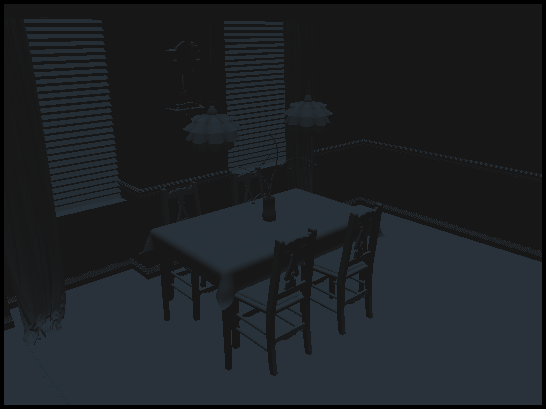
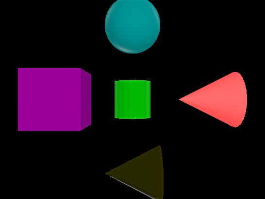
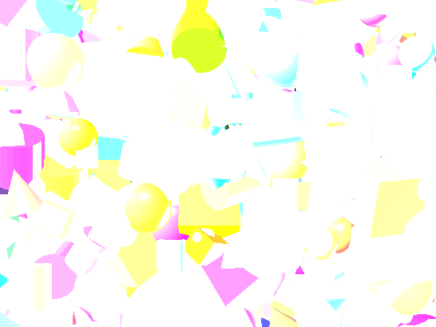
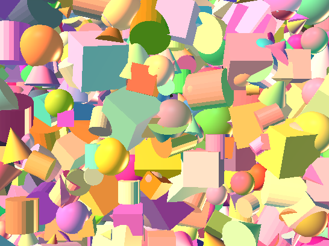

## Project 6: Final Project Gear Up

The project handout can be found [here](https://cs1230.graphics/projects/final/gear-up).

### Test Cases

#### Mesh Loading:
| | |
| --- | --- |
| Single object OBJ: | |
| Many object OBJ: |  |

#### HDR:

| | Without tonemapping | With tonemapping |
| --- | --- | --- |
| Dark/light objects |  |  |
| Overexposure |  |  |

#### Camera paths:

| | |
| --- | --- |
| Primitives: |  |
| Mesh: |  |

### Design Choices

* I use tinyobjloader to read obj files for rendering.
  * OBJ files support multiple shapes, which is important for texturing each object seperately. I read each object as its own shape and store all in the renderShapeData vector.
  * I do the face -> tri conversion directly in the scene reader and store the vertices/normals as an extra parameter for each shape.
* For HDR tonemapping, I render into an FBO and perform a tonemapping pass using a full-screen quad shader.
  * The tonemapper of choice is the [Durand operator.](https://web.stanford.edu/class/ee367/reading/FastBilateralFilteringforHDR.pdf)
  * Obtaining the maximum/minimum of a texture is incredibly tedious without compute shader capabilities introduced in GLM 4.30, so I hardcoded some values that produced nice results.
* For camera bezier curves, I use a cubic interpolation scheme and calculate the camera position using a time parameter that is updated each frame.
  * The rotation matrix is converted into a quaternion to perform smooth spherical interpolation.

### Collaboration/References

Some high-level communication with my group members on project features.
Referenced [https://github.com/canmom/rasteriser](https://github.com/canmom/rasteriser) for examples on how to use TinyOBJ. Referenced Wikipedia, GLM documentation, cppreference. Asked ChatGPT about Bezier curves.

### Known Bugs

None as far as I can tell.

### Extra Credit

N/A
